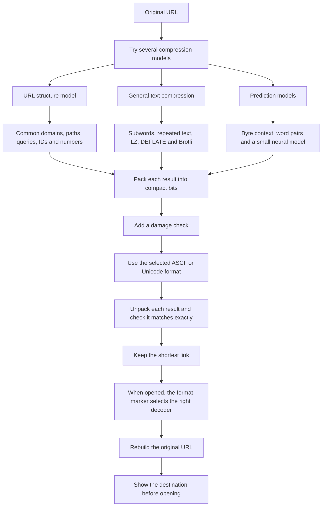

# pi.sg

A cool link compressor that doesn't store your links.

[Try Pi](https://pi.sg)

Pi compresses your link, just like a zip file compresses files. When someone opens it, Pi unpacks it to get the original address.

Extra compression uses the server's computing power to try making your link even smaller. Your link is sent to the server, but isn't stored anywhere. Switch it off if you want to keep everything in your browser.

The destination stays inside the Pi link, so Pi doesn't need a link database. It also doesn't visit the destination.

Every Pi link shows the full destination before it can be opened. Read the [privacy and security page](https://pi.sg/privacy) for the logging policy and other details.

## Options

- **Unicode** makes the link look shorter.
- **ASCII** works better in apps that struggle with Unicode links.
- **Extra compression** asks the server to try more compression methods. Pi only uses its result if it is shorter.

Some links may still get longer. Pi always shows the real difference before you copy the link.

## How Pi works

Pi doesn't rely on one compressor. It tries several different models and keeps the one that makes the shortest link.



The URL structure model knows that links usually contain a scheme, domain, path, query, and fragment. Common domains and URL patterns can be stored as small numbers instead of being written out in full.

The prediction models work a bit like autocomplete. One looks at the previous bytes and common word pairs. Another small neural model looks at up to 48 previous bytes. When a character is easy to predict, arithmetic coding can store it using less space.

These models are fixed files that come with Pi. They don't learn from submitted links. Extra compression runs the larger models on the server, while the browser handles the lighter methods itself.

Before Pi uses a result, it unpacks it again. If it doesn't produce the exact original URL, including its spelling, escaping, query order, and fragment, Pi rejects it. The shortest valid result becomes the final link.

## Run Pi

You need Node.js 26.5 or newer, npm, and a C++17 compiler.

```sh
npm ci
npm start
```

Open [localhost:8788](http://127.0.0.1:8788).

To run the tests:

```sh
npm test
```

You can also use Docker:

```sh
docker compose up --build
```

## More details

See [production notes](docs/production.md) for server limits, rollback steps, and optional bot protection. The exact link formats are documented in [format notes](docs/format.md). Credits and licenses are in [NOTICE.md](NOTICE.md).
