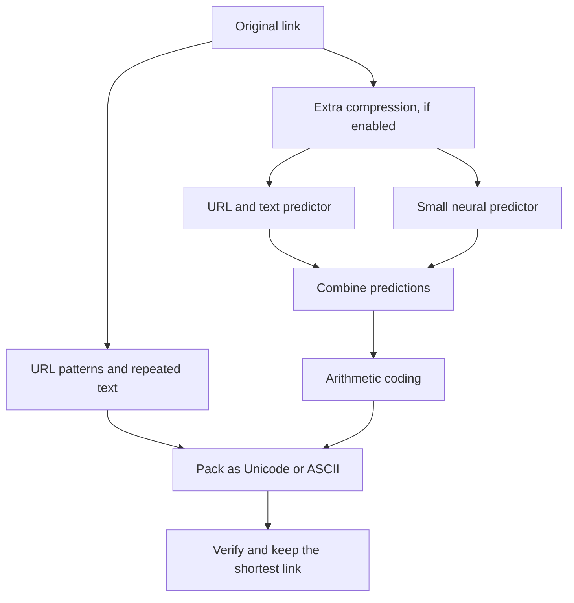

# pi.sg

A cool link compressor that doesn't store your links.

[Try Pi](https://pi.sg)

Pi compresses your link, just like a zip file compresses files. When someone opens it, Pi unpacks it and shows the original address before they continue.

Extra compression uses the server's computing power to try making your link even smaller. Your link goes to the server, but isn't saved. Switch it off if you want to keep everything in your browser.

The original address stays inside the Pi link, so there's no link database. Pi doesn't visit the destination either. The [privacy and security page](https://pi.sg/privacy) explains what happens to your data.

## Options

- **Unicode** makes the link look shorter.
- **ASCII** works better in apps that struggle with Unicode links.
- **Extra compression** asks the server to try more compression methods. Pi only uses its result if it is shorter.

Some links may still get longer. Pi always shows the real difference before you copy the link.

## How Pi works

Pi tries several compressors and keeps the shortest valid result.



The browser compressors look for common URL parts and repeated text. They work without sending your link anywhere.

On the server, two predictors estimate what comes next in the URL. One uses common domains, words, and URL patterns; the other is a small neural model. Pi combines their predictions for each byte. Arithmetic coding then uses fewer bits for the bytes they predict well.

Pi packs those bits directly into the link's characters to avoid wasting space. Longer links, or requests that take too long, can use the other compressors instead. The models are fixed files that come with Pi and don't learn from submitted links.

Before returning a result, Pi checks it against every original byte. Links also include a small checksum to help detect accidental damage. It isn't encryption or protection against deliberate changes.

## Run Pi

You need Node.js 26.5 or newer, npm, and a C++17 compiler.
Node.js development headers are also required; set `PI_NODE_HEADERS` if needed.

```sh
npm ci
npm start
```

Open [localhost:8788](http://127.0.0.1:8788).

To check the code:

```sh
npm run check
npm test
```

For a fresh Docker installation:

```sh
PI_PREDICTION_ENCODE=1 docker compose up --build
```

If you're upgrading an existing installation, follow the [rollout steps](docs/production.md#compose-with-an-existing-proxy) so the new decoder is available before Pi starts making new links.

## More details

See [production notes](docs/production.md) for server limits, rollback steps, and optional bot protection. The exact link formats are documented in [format notes](docs/format.md). Credits and licenses are in [NOTICE.md](NOTICE.md).

Pi is released under the [MIT License](LICENSE).
