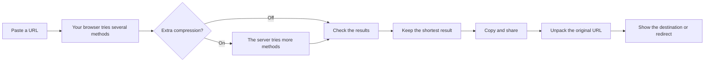

# pi.sg

A cool link compressor that doesn't store your links.

[Try Pi](https://pi.sg)

Pi compresses your link, just like a zip file compresses files. When someone opens it, Pi unpacks it to get the original address.

Extra compression uses the server's computing power to try making your link even smaller. Your link is sent to the server, but isn't stored anywhere. Switch it off if you want to keep everything in your browser.

The destination stays inside the Pi link, so Pi doesn't need a link database. It also doesn't visit the destination.

## Options

- **Unicode** makes the link look shorter.
- **ASCII** works better in apps that struggle with Unicode links.
- **Show destination first** lets the person opening the link see where it goes before continuing.
- **Extra compression** asks the server to try more compression methods. Pi only uses its result if it is shorter.

Some links may still get longer. Pi always shows the real difference before you copy the link.

## How Pi works



Pi looks for familiar patterns in the domain, path, query, words, and numbers. It tries several ways to compress them, checks that each result turns back into the exact same URL, then keeps the shortest one.

The compressed data and a small damage check are placed inside the Pi link. When someone opens it, Pi reads that data, rebuilds the original URL, and either redirects there or shows the destination first.

## Run Pi

You need Node.js 26.5 or newer, npm, and a C++17 compiler.

```sh
npm ci
npm start
```

Open [localhost:8788](http://127.0.0.1:8788).

To run the tests:

```sh
npm test
```

You can also use Docker:

```sh
docker compose up --build
```

## More details

See [production notes](docs/production.md) for server limits, rollback steps, and optional bot protection. The exact link formats are documented in [format notes](docs/format.md). Credits and licenses are in [NOTICE.md](NOTICE.md).
